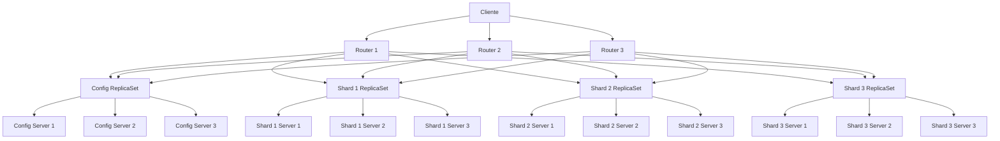
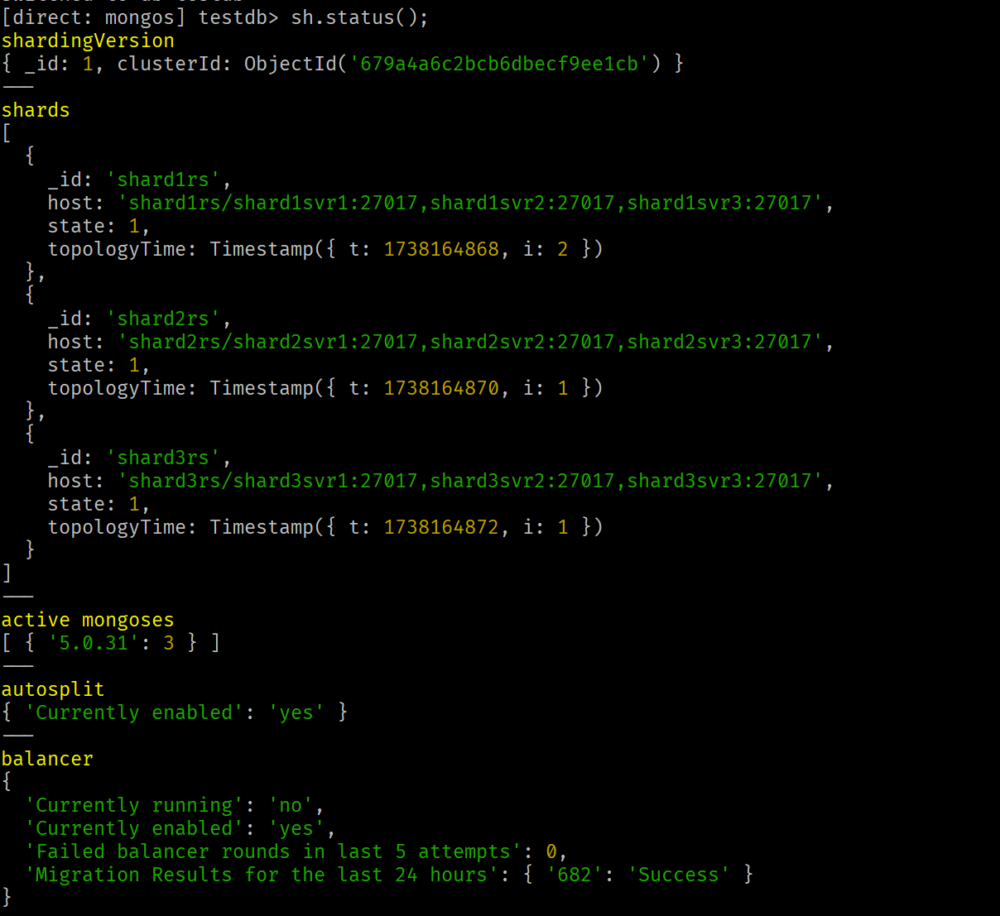
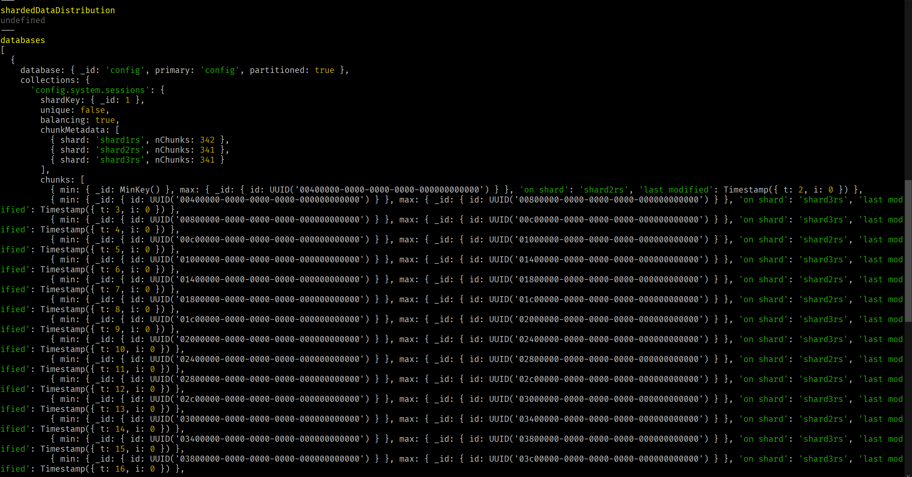
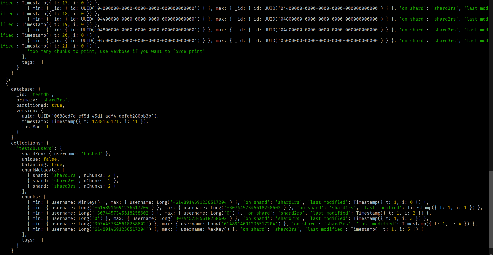
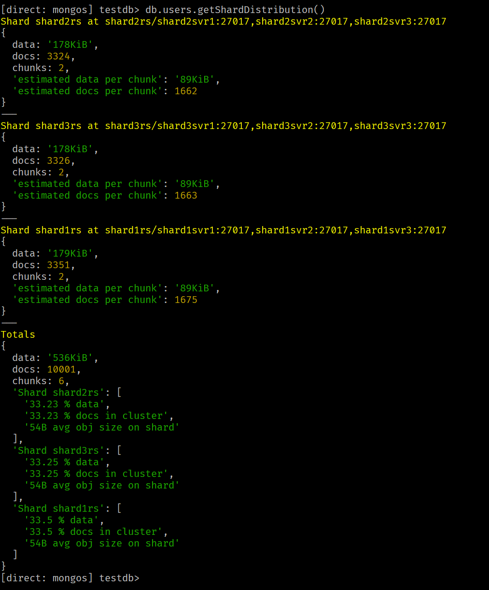

# Despliegue de una Arquitectura Sharded Cluster en MongoDB con Docker

## Introducción

Este informe detalla el proceso de despliegue de una arquitectura de base de datos NoSQL MongoDB utilizando contenedores Docker. Se implementó una solución escalable y distribuida mediante la configuración de:

- Un ReplicaSet de routers (mongos) para distribuir las solicitudes de los clientes.
- Un ReplicaSet de servidores de configuración (config server) para gestionar la metadata del clúster.
- Un Sharded Cluster compuesto por tres ReplicaSet, cada uno con tres nodos, para el almacenamiento distribuido de datos.

## Estructura del Clúster

El clúster desplegado tiene la siguiente estructura:



## Pasos de Implementación

### 1. Creación de la Estructura de Archivos

Se creó un directorio de trabajo llamado `mongo-sharded-cluster` con los siguientes archivos:

- `docker-compose.yml`: Define los servicios para el clúster.
- `init-shard.sh`: Script para inicializar los ReplicaSets y configurar el sharding.


### 2. Configuración de Docker Compose

El archivo `docker-compose.yml` define los siguientes servicios:

- 3 nodos para el Config Server ReplicaSet
- 9 nodos para los Shard ReplicaSets (3 ReplicaSets con 3 nodos cada uno)
- 3 nodos para los routers (mongos)


Aquí se muestra un extracto del archivo `docker-compose.yml`:

```yaml
version: '3'

services:
  # Config Servers
  cfgsvr1:
    image: mongo:5.0
    container_name: cfgsvr1
    command: mongod --configsvr --replSet cfgrs --port 27017 --dbpath /data/db
    volumes:
      - cfgsvr1:/data/db
    networks:
      - mongocluster

  # ... (otros config servers)

  # Shard 1 Replica Set
  shard1svr1:
    image: mongo:5.0
    container_name: shard1svr1
    command: mongod --shardsvr --replSet shard1rs --port 27017 --dbpath /data/db
    volumes:
      - shard1svr1:/data/db
    networks:
      - mongocluster

  # ... (otros shards)

  # Routers
  router1:
    image: mongo:5.0
    container_name: router1
    command: mongos --configdb cfgrs/cfgsvr1:27017,cfgsvr2:27017,cfgsvr3:27017 --bind_ip 0.0.0.0 --port 27017
    ports:
      - 27117:27017
    networks:
      - mongocluster
    depends_on:
      - cfgsvr1
      - cfgsvr2
      - cfgsvr3

  # ... (otros routers)

networks:
  mongocluster:
    driver: bridge

volumes:
  cfgsvr1:
  # ... (otros volúmenes)
```

### 3. Inicialización de los ReplicaSets

Se creó un script `init-shard.sh` para inicializar los ReplicaSets y configurar el sharding:

```shellscript
#!/bin/bash

# Inicializar Config Server Replica Set
docker exec -it cfgsvr1 mongosh --eval "
rs.initiate(
  {
    _id: \"cfgrs\",
    configsvr: true,
    members: [
      { _id : 0, host : \"cfgsvr1:27017\" },
      { _id : 1, host : \"cfgsvr2:27017\" },
      { _id : 2, host : \"cfgsvr3:27017\" }
    ]
  }
)"

# ... (inicialización de otros ReplicaSets)

# Agregar shards al cluster
docker exec -it router1 mongosh --eval "
sh.addShard(\"shard1rs/shard1svr1:27017,shard1svr2:27017,shard1svr3:27017\")
sh.addShard(\"shard2rs/shard2svr1:27017,shard2svr2:27017,shard2svr3:27017\")
sh.addShard(\"shard3rs/shard3svr1:27017,shard3svr2:27017,shard3svr3:27017\")
"

echo "Sharded Cluster inicializado y configurado"
```

### 4. Despliegue del Clúster

Se ejecutaron los siguientes comandos para desplegar el clúster:

```shellscript
docker-compose up -d
chmod +x init-shard.sh
./init-shard.sh
```

## Pruebas y Verificación

### 1. Conexión al Router

```shellscript
docker exec -it router1 mongosh
```

### 2. Configuración del Sharding

```javascript
// Habilitar sharding para la base de datos
sh.enableSharding("testdb")

// Crear una colección sharded
sh.shardCollection("testdb.users", { "username": "hashed" })
```

### 3. Inserción de Datos de Prueba

```javascript
use testdb

for (let i = 0; i < 10000; i++) {
  db.users.insertOne({ username: "user" + i, age: Math.floor(Math.random() * 100) })
}
```

### 4. Verificación de la Distribución de Datos

```javascript
sh.status()
db.users.getShardDistribution()
```

## Resultados

### Estado del Sharding





### Distribución de Datos



## Análisis de Chunks y Colecciones

- Número total de chunks: 6 (2 chunks por cada shard)

- Distribución de chunks por shard:
    - Shard 1: 33.5% data
    - Shard 2: 33.23% data
    - Shard 3: 33.25% data

- Colecciones almacenadas:
    - testdb.users


La colección `testdb.users` se distribuye entre los shards utilizando un índice hash en el campo `username`. Esto asegura una distribución uniforme de los datos entre los shards.

## Desafíos Encontrados y Soluciones

1. **Problema de conectividad entre contenedores**:

1. Desafío: Inicialmente, los contenedores no podían comunicarse entre sí.
2. Solución: Se creó una red Docker personalizada (`mongocluster`) y se aseguró que todos los servicios estuvieran conectados a esta red.


2. **Tiempos de espera en la inicialización**:

1. Desafío: Los ReplicaSets necesitaban tiempo para inicializarse antes de poder agregar los shards.
2. Solución: Se agregó un `sleep 30` en el script `init-shard.sh` para dar tiempo a que los ReplicaSets se inicializaran completamente.


3. **Configuración del balanceo de chunks**:

1. Desafío: Por defecto, el balanceo de chunks puede no ser óptimo para cargas de trabajo específicas.
2. Solución: Se puede ajustar la configuración del balanceador usando comandos como:

```javascript
sh.setBalancerState(true)
db.settings.updateOne(
  { _id: "balancer" },
  { $set: { activeWindow: { start: "02:00", stop: "07:00" } } },
  { upsert: true }
)
```


## Conclusiones

El despliegue exitoso de un MongoDB Sharded Cluster utilizando Docker demuestra la capacidad de crear una infraestructura de base de datos distribuida y escalable. Este enfoque permite:

1. Distribución eficiente de datos entre múltiples shards.
2. Alta disponibilidad a través de ReplicaSets.
3. Escalabilidad horizontal añadiendo más shards según sea necesario.


La arquitectura implementada proporciona una base sólida para aplicaciones que requieren manejo de grandes volúmenes de datos y alto rendimiento en operaciones de lectura y escritura.